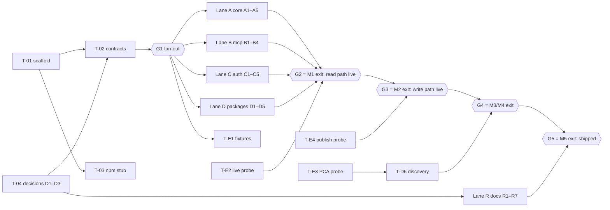

# Parallel Work Plan (v1.0)

> Execution-level breakdown of [roadmap.md](roadmap.md) into small, agent-sized
> tasks (`T-*`) that can be developed **concurrently by independent agents**.
> The roadmap remains the milestone/gate view (M0–M6); this document is the task
> view. Each roadmap phase is reached by integrating a set of tasks at a gate
> (G1–G5 below). Sizes reuse the roadmap classes: S < half a day, M ≈ 1–2 days,
> L ≈ 3+ days — per task, for one agent.

## 1. Working agreement (what makes parallelism safe)

1. **Contract-first.** Task T-02 freezes the shared interfaces (`ToolSpec`,
   `InstagramError`, `IgRequestFn`, `AuthProvider`, config/profile shapes,
   `Clock`, test seams). Merging T-02 is **Gate G1** — nothing else starts
   before it; everything after it builds against those types with mocks.
2. **Exclusive file ownership.** Every task lists its owned files; a file
   belongs to exactly one task. Cross-cutting edits go through the owning task.
   Integration points are designed to be append-only one-liners (a new package
   = one import line in the registry), so merges stay trivial.
3. **Contract-change protocol.** After G1 the contract files are frozen.
   A needed change becomes a dedicated *contract-bump* PR touching only
   contract files, listing every impacted task; feature branches never edit
   contract files. This is the only coordination point between agents.
4. **Mocks at the seams.** Domain tasks (Lane D) build against a mocked
   `IgRequestFn` (the `withFetch` recording helper from T-02); auth/core tasks
   are consumed via their interfaces. No task waits for another's
   *implementation* — only for its *interface* (already frozen at G1).
5. **Tests travel with the task.** Definition of done for every task:
   its unit tests colocated and green, `npm run check` green locally with the
   rest of the system mocked, owned docs updated, corner cases from its
   `CC owed` column either tested or explicitly deferred to a live probe.
6. **Branch naming** `task/<id>-<slug>` (e.g. `task/T-D3a-publishing-primitives`);
   one PR per task; the task ID in the PR title.
7. **House rules** apply to every agent: English-only repo content, no AI
   attribution, secrets never in code/fixtures/logs, layer boundaries
   (`core ← api ← mcp ← tools`) enforced by lint.
8. **Live credentials are a singleton.** Only Lane E tasks touch the real junk
   account; everything else runs on mocks/fixtures. Lane E has a single owner
   at any time.

## 2. Serial foundation (Wave 0 — no parallelism yet)

| ID | Task & scope | Owned files | Depends on | Size |
|---|---|---|---|---|
| **T-01** | **Scaffold** — npm/TS ESM `Node16`, Node ≥ 22 engines + `.nvmrc`, ESLint 9 flat (4-layer boundaries, `no-console` — CC-PROC-1), Prettier, `node:test` + `c8` + `fast-check` wired to built output, CI matrix (Node 22/24 × ubuntu/macOS/Windows), `npm audit` + CodeQL, MIT `LICENSE`, `.env.example` stub, `.git/info/exclude` for AI-harness files | root configs, `.github/workflows/`, `LICENSE` | — | M |
| **T-02** | **Contracts freeze** *(= Gate G1)* — `InstagramError` + `kind`, Graph envelope/paging types, `ToolSpec`/`ToolResult`/annotations, `AuthProvider` + auth-mode types, `IgRequestFn` signature + options, config/profile/settings shapes, `Clock` interface; test seams: `withFetch` recording mock, `fakeClock`, fixture loader | `src/core/types.ts`, `src/core/clock.ts`, `src/mcp/define.ts`, `test/helpers/` | T-01, T-04 (D1 shapes `ToolSpec.paths`) | M |
| **T-03** | **npm stub** — publish `instagram-mcp-ai@0.0.1` placeholder (name verified available 2026-07-21; adjacent names squatted) | stub `package.json` only | T-01 (minimal) | S |
| **T-04** | **Decision records** — ratify D1–D3 with the owner and write them into auth/architecture/security docs; record the no-debate decisions: tools-only MCP surface in v1 (no Resources/Prompts), no proxy support in v1, `doctor` surfaces Meta-app Development/Live mode | decision paragraphs in `docs/` | — (docs only; **needs owner sign-off**) | S |

## 3. Parallel lanes (all unblock at G1)

### Lane A — core substrate

| ID | Task & scope | Owned files | Depends on | CC owed | Size |
|---|---|---|---|---|---|
| T-A1 | Config + profiles: env-file resolution (`IG_ENV_FILE` → XDG → project; `%APPDATA%` on win32), atomic comment-preserving `0600` writes, profiles via `AsyncLocalStorage` | `src/core/config.ts` | G1 | CC-CFG-1/2/3/5/8, CC-CFG-4 (mechanism) | M |
| T-A2 | Settings + env catalog: every §12 knob as a documented reader (incl. `IG_TIMEOUT_MS`, `IG_LOG_LEVEL`); machine-readable catalog for generators; stderr JSON logger with levels + `safeUrl` | `src/core/settings.ts`, `src/core/log.ts` | G1 | — | M |
| T-A3 | Redaction: mask configured secrets + token-shape patterns; **runtime-minted token registration API** (login/refresh outputs, `appsecret_proof`); `fast-check` property tests | `src/core/redact.ts` | G1 | — | S |
| T-A4 | HTTP client: host allowlist (SSRF), `igRequest` with retry matrix, `Retry-After` cap, semaphore (`IG_MAX_CONCURRENT`), `AbortSignal`, `IG_TIMEOUT_MS`, usage-header parsing, pinned `v25.0` | `src/core/host.ts`, `src/core/http.ts` | G1 (A2/A3 via interfaces) | CC-RATE-1/2/3/6, CC-PROC-2 | L |
| T-A5 | Error mapping: Graph error envelope → `InstagramError` kinds; full subcode table from operations.md (80002, 2207051, 24/2207008, 9007/2207027, 9/2207042, 4/17/32/613); table-driven tests | `src/core/errors.ts` | G1 | mapping rows of the taxonomy | S |

### Lane B — MCP glue

| ID | Task & scope | Owned files | Depends on | CC owed | Size |
|---|---|---|---|---|---|
| T-B1 | Registry + PACKAGES manifest: resolution order (profile → deny → readonly), invariant loop, **D1 capability filtering** (`ToolSpec.paths`), manifest snapshot test. New packages = one appended import line | `src/mcp/registry.ts` | G1 | CC-CFG-6/7 | M |
| T-B2 | Results: `{items, paging}` shape, code-point-safe char-budget truncation, `IG_PRETTY_JSON`, **injection fencing** wrapper marking untrusted text (comments, captions) as data; property tests | `src/mcp/result.ts` | G1 | CC-DATA-3/4, CC-PROC-6 | M |
| T-B3 | Write gate + journal per **D3**: preview/apply resolution, elicitation-or-env fallback, append-only `O_APPEND` JSON-lines journal | `src/mcp/write-mode.ts` | G1, T-04 (D3) | CC-PROC-3/5, CC-PUB-16 | M |
| T-B4 | Transports + entry: stdio (stdout purity), Streamable HTTP (loopback, `timingSafeEqual` bearer), `index.ts` Node guard + subcommand routing + bootstrap | `src/mcp/transport.ts`, `src/index.ts` | G1 | CC-PROC-1/4 | M |

### Lane C — auth & CLI

| ID | Task & scope | Owned files | Depends on | CC owed | Size |
|---|---|---|---|---|---|
| T-C1 | Auth providers: both paths, per-profile mode resolution, `appsecret_proof` on `graph.facebook.com` only, startup validation | `src/core/auth.ts` | G1 | CC-AUTH-5/6/10/11 | M |
| T-C2 | Token metadata + status: `debug_token` (Path B) / `/me` fallback (Path A), expiry math on the injectable clock, scope inventory, usage snapshot; exposes `getTokenStatus()` consumed by T-D1's tool | `src/api/token-status.ts` | G1, C1 (interface) | CC-AUTH-1/7/9/12/13 | M |
| T-C3 | `login` CLI: loopback OAuth for both paths, random+checked `state`, code → short → long-lived exchange, persist via T-A1's writer, register minted token with T-A3 | `src/cli/login.ts` | A1, A3, C1 | CC-CFG-4 (exercise) | L |
| T-C4 | Refresh per **D2**: `ig_refresh_token`, `IG_REFRESH_AFTER_DAYS` threshold, re-read-before-write guard, per-channel policy | `src/core/refresh.ts` | C2, A1, T-04 (D2) | CC-AUTH-2/3/4/14 | M |
| T-C5 | `doctor` CLI: token validity, account resolution, scopes, quota, usage snapshot, **Meta-app Development/Live mode**, **config-tier report** (token-only vs full) | `src/cli/doctor.ts` | C1, C2 (rest mocked) | — | M |

### Lane D — domain packages (api + tools + tests per package; all mock `IgRequestFn` until G2)

| ID | Task & scope | Owned files | Depends on | CC owed | Size |
|---|---|---|---|---|---|
| T-D1 | `account` package (3 tools; `token_status` wraps T-C2's function) | `src/api/account.ts`, `src/tools/account.ts` | G1, C2 (interface) | — | S |
| T-D2 | `media` package (3 tools; carousel children, deleted-media handling, open enums + passthrough output schemas) | `src/api/media.ts`, `src/tools/media.ts` | G1 | CC-DATA-1/2/5/6/7 | S |
| T-D3a | `publishing` primitives (4 tools): container create (**no `media_type` for feed images**), status, publish (**never auto-retried**), runtime quota read; client-side media validation (JPEG-only, size/aspect/duration, code-point captions); `alt_text` support `[verify — live probe]` | `src/api/publishing.ts`, `src/api/media-spec.ts`, `src/tools/publishing.ts` | G1 | CC-PUB-1/3/4/7/8/9/10/11/12/14/15 | M |
| T-D3b | `publishing` composites (`post_image`/`post_reel`/`post_story`): 60 s poll budget on the injectable clock, resumable results + `resume_container_id`, carousel orchestration, quota refusal | `src/tools/publishing-composites.ts` | D3a, B3 | CC-PUB-2/5/6/13, CC-RATE-5 | M |
| T-D4 | `comments` package (8 tools): threading, disabled-comments, `IG_ALLOW_DESTRUCTIVE` double gate, **fencing applied to comment text** (via T-B2), `list_tagged_media` tags-vs-mentions semantics | `src/api/comments.ts`, `src/tools/comments.ts` | G1, B2/B3 (interfaces) | CC-COM-1..7 | M |
| T-D5 | `insights` package (4 tools): per-`media_product_type` metric matrix, required `timeframe`, 90-day retention clamp, `online_followers` watch-list, `follower_count` metric `[verify — live probe]` | `src/api/insights.ts`, `src/tools/insights.ts` | G1 | CC-INS-1/2/3/5/6/7 | M |
| T-D6 | `discovery` package (3 tools, **gated on T-E3 = GO**): local hashtag-budget tracker (30/7d, self-healing), `business_discovery` | `src/api/discovery.ts`, `src/tools/discovery.ts` | G1, **T-E3** | CC-RATE-4 | M |

### Lane E — live QA (single owner; the only lane touching real credentials)

| ID | Task & scope | Owned files | Depends on | Size |
|---|---|---|---|---|
| T-E1 | Fixture-capture harness: record live Graph responses, **sanitize** (IDs, tokens, PII), store as unit-test fixtures | `scripts/capture-fixtures.ts`, `test/fixtures/` | G1 | S |
| T-E2 | M1 live-probe protocol (corner-cases §9): both auth paths smoke-tested on the junk account; answers read-side `[verify]` items (CC-INS-4 timezone, CC-AUTH-14); feeds T-E1 fixtures | probe notes in `docs/corner-cases.md` §9 | read path integrated (pre-G2) | M |
| T-E3 | **PCA/hashtag probe**: does `ig_hashtag_search` work for an own-app admin without App Review? Decides T-D6's fate. Runnable early with a throwaway script | probe record in `docs/auth.md` §5 | C1 (or standalone script) | S |
| T-E4 | Publishing/moderation live protocol: **stories-first** (self-expiring), minimal feed posts; answers CC-PUB-4 (double publish), CC-PUB-6 (mixed carousel), CC-PUB-11 (caption unit), CC-COM-5/6 (hide rules, length cap) | probe notes in `docs/corner-cases.md` §9 | write path integrated (pre-G3) | M |

### Lane R — release & user docs (docs tasks can start right after T-04)

| ID | Task & scope | Owned files | Depends on | Size |
|---|---|---|---|---|
| T-R1 | **Setup guide + troubleshooting**: Meta-app creation → both auth paths → token in hand, Development-vs-Live mode, troubleshooting table (top errors → causes → fixes) | `docs/setup-guide.md`, `docs/troubleshooting.md` | T-04; polish after E2 | M |
| T-R2 | **Stability policy + config tiers**: semver for the tool surface (rename = breaking; deprecation via dual registration), config-tier matrix (token-only vs full: what works, what degrades, refresh `[verify]`) | `docs/stability.md` | T-04 | S |
| T-R3 | README generated sections (tool table, env catalog) + docs-sync tests | `scripts/gen-readme.ts`, `test/docs-sync.test.ts` | B1, A2 | S |
| T-R4 | npm packaging: `.cjs` bin launcher (Node guard → ESM `import()`), `prepublishOnly` full gate, provenance | `bin/instagram-mcp-ai.cjs` | T-01 | S |
| T-R5 | `server.json` + MCP-registry publish (`io.github.IvanBBaev/instagram-mcp-ai`), generated + sync-tested | `server.json`, gen script | R4, A2 | S |
| T-R6 | MCPB bundle: keychain-backed `user_config`, token-acquisition story for non-CLI users | MCPB manifest | R4, C3 | M |
| T-R7 | `SECURITY.md`, `CHANGELOG.md`, release checklist, three-channel version-drift test | those files | — | S |

## 4. Dependency graph



## 5. Integration gates → roadmap mapping

| Gate | Means | Integrates | Roadmap |
|---|---|---|---|
| **G1** | Contracts frozen, fan-out begins | T-01..T-04 | M0 exit |
| **G2** | Real reads on both auth paths | A1–A5, B1/B2/B4, C1/C2/C5, D1/D2, E1/E2/E3 | M1 exit |
| **G3** | Real publish via preview → apply; duplicate-post chain provably broken | B3, C3/C4, D3a/D3b, E4 (publishing) | M2 exit |
| **G4** | Moderation + insights (+ discovery if E3 = GO) live | D4, D5, D6, E4 (moderation) | M3+M4 exit |
| **G5** | Three-channel distribution install-tested | R1–R7 | M5 exit |

Gate reviews are **integration tasks in their own right** (wire the lanes in
`index.ts`/registry, run the full live protocol, snapshot review) — owned by one
integrator agent per gate, not parallelized.

## 6. Suggested waves (max useful concurrency)

- **Wave 0 (serial):** T-04 → T-01 → T-02 (+T-03 alongside). One agent, plus the
  owner ratifying decisions.
- **Wave 1 (after G1) — up to ~14 parallel:** A1 A2 A3 A4 A5 · B1 B2 B4 · C1 C2
  · D1 D2 D3a D5 · E1 E3 · R1 R2 R4 R7 (throttle to taste; file ownership makes
  any subset safe).
- **Wave 2:** B3 (needs D3), C3 C4 C5 · D3b D4 · R3 R5 → **G2 integration** →
  T-E2.
- **Wave 3:** G3 integration + T-E4 · D6 (if E3 GO) · R6 → G4 → G5.

The critical path is **T-04 → T-02 → A4 → G2 → D3b/E4 → G3**; everything else
has slack. If only one thing gets extra agents, it is Lane A4 review and the
gate integrations.

## 7. Agent task brief (template)

Every task agent gets this brief:

```
Task: <T-ID> — <title>            Branch: task/<id>-<slug>
Read first: docs/architecture.md §<n>, docs/<relevant>.md, docs/corner-cases.md (your CC rows)
You own ONLY: <owned files> (+ colocated tests). Do not edit contract files or other tasks' files.
Contracts: src/core/types.ts, src/mcp/define.ts, src/core/clock.ts, test/helpers/ — frozen; if a change is unavoidable, stop and request a contract-bump.
Definition of done: unit tests green; `npm run check` green; CC rows tested or explicitly deferred to a live probe; owned docs updated.
House rules: English only; no AI attribution; no secrets anywhere; layer imports core ← api ← mcp ← tools.
```
